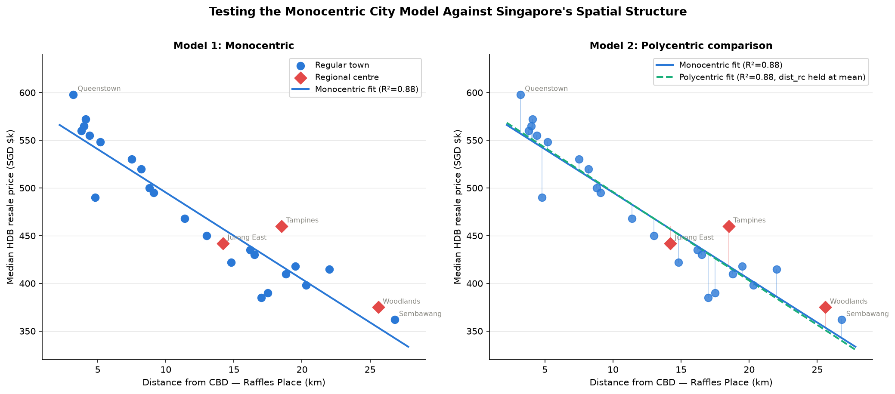

<h1 align="center">The Polycentric Paradox</h1>

<p align="center">
  <em>Does the classic monocentric city model still explain Singapore's housing market —<br>or has the island gone polycentric?</em>
</p>

<p align="center">
  <a href="https://remiscales.github.io/bid-rent-equilibrium/"><b>▶ Open the interactive demo</b></a>
  &nbsp;·&nbsp;
  <a href="#the-question">The question</a>
  &nbsp;·&nbsp;
  <a href="#results">Results</a>
  &nbsp;·&nbsp;
  <a href="#whats-in-here">What's in here</a>
</p>

<p align="center">
  
</p>

> Built as a project for a classmate — the goal was an interactive, hand-on-the-controls way
> to *see* an urban-economics idea, not just read about it.

## The main thing: [`index.html`](index.html)

**This repo is really the interactive web app.** Open [`index.html`](index.html) (or the
[live demo](https://remiscales.github.io/bid-rent-equilibrium/)) and you get the whole thing in the
browser — toggle between the monocentric and polycentric models, watch the fit animate in, and hover
any town for its price and distance. No install, no dependencies beyond a CDN copy of Chart.js.

The two Python scripts are just **plain fallbacks** — the same analysis with no interactivity, for
anyone who'd rather run the numbers in a terminal or drop the regression into their own notebook.

## The question

Urban economics starts with the **monocentric city model** (Alonso–Muth–Mills): land and housing are
most valuable at the Central Business District, and prices decay with distance as households trade off
commuting cost against space. The prediction is a smooth, downward-sloping **bid-rent gradient**.

But Singapore was deliberately engineered to be **polycentric** — the URA's *Regional Centres*
(Tampines, Jurong East, Woodlands) were built to pull jobs and value away from the Raffles Place core.
So which story do the numbers actually tell?

Both models are fit to median HDB resale prices across 26 towns:

- **Model 1 — Monocentric:** `price ~ distance_to_CBD`
- **Model 2 — Polycentric:** `price ~ distance_to_CBD + distance_to_nearest_regional_centre`

If Singapore is meaningfully polycentric, adding the regional-centre term should improve the fit.

## Results

| Model | Specification | Slope (CBD) | Regional-centre effect | R² |
|-------|---------------|------------:|-----------------------:|-----:|
| **Monocentric** | dist to CBD only | −$9.1k / km | — | **0.879** |
| **Polycentric** | dist to CBD + dist to RC | −$9.3k / km | −$0.4k / km | **0.879** |

**The monocentric model wins decisively.** Distance from the CBD alone explains **~88%** of the
variation in resale prices (p < 0.0001). Adding proximity to the nearest regional centre improves the
fit by essentially **nothing** (ΔR² ≈ 0), and its coefficient is statistically negligible — in the demo
the two fitted lines sit almost exactly on top of each other.

> Despite decades of deliberate decentralisation policy, the *price surface* of Singapore's HDB market
> remains strongly monocentric — the Raffles Place gradient still dominates. Regional centres may move
> jobs, but the resale market is still priced off the historic core.

The interactive app and the Python scripts share the same data and the same OLS method, so they report
the same numbers.

## What's in here

| File | Role |
|------|------|
| **[`index.html`](index.html)** | **The project.** Interactive Chart.js app — model toggle, animated fit, hover tooltips. Deployed as the [live demo](https://remiscales.github.io/bid-rent-equilibrium/). |
| [`city_model.py`](city_model.py) | Plain fallback — runs both regressions, prints the results table, renders `preview.png`. |
| [`city_model_interactive.py`](city_model_interactive.py) | Plain fallback — a matplotlib desktop GUI version. |
| [`preview.png`](preview.png) | Rendered output of the static script (the image above). |

## Run it

**The app** — just open `index.html` in any browser, or visit the
[live demo](https://remiscales.github.io/bid-rent-equilibrium/).

**The Python fallbacks**
```bash
git clone https://github.com/remiscales/bid-rent-equilibrium.git
cd bid-rent-equilibrium
pip install -r requirements.txt

python3 city_model.py               # prints results + saves preview.png
python3 city_model_interactive.py   # desktop GUI
```

## Data & method note

Town-level figures are **realistic estimates** calibrated to well-documented Singapore HDB spatial
patterns (distances measured straight-line from Raffles Place; regional centres per URA planning),
not a scrape of official transaction records. The point is the **method** — fitting and comparing
spatial price-gradient models — rather than a precise valuation of any given town. Swapping in official
HDB resale data is a natural next step.

## License

[MIT](LICENSE) © 2026 JRMH ([remiscales](https://github.com/remiscales))
